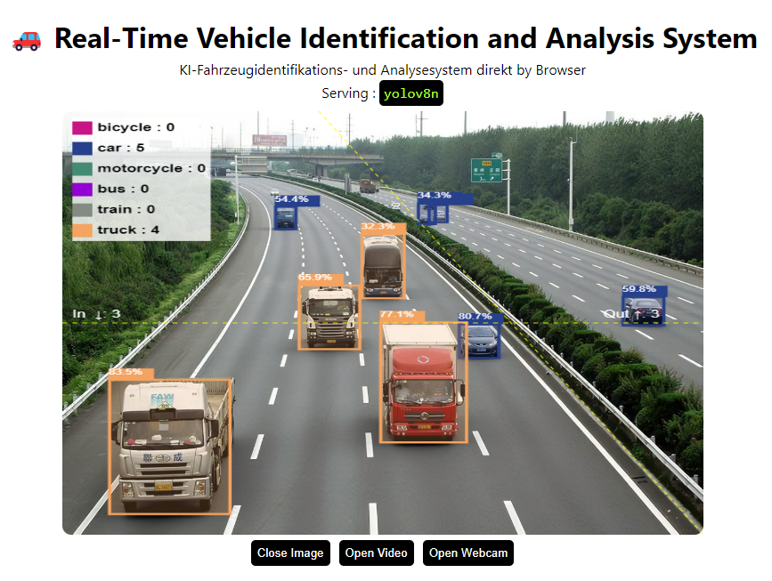

# 🚗 Real-Time Vehicle Identification and Analysis System

<p align="center">
  
</p>

**LINK zur KI-Gesichtsmaskenerkennung direkt in Browser:**
  https://miaoima.github.io/Vehicle_Identification/
---
---


**Beschreibung**
Dieses Projekt nutzt das bereits trainierte yolov8n-Modell, welches eine hohe Genauigkeit in der Erkennung und Messung zeigt, und das Modell reagiert auch sehr schnell. Obwohl beim Verarbeiten von Videos einige Rahmen und Bilder nicht synchron sind, ist das Gesamtergebnis akzeptabel. Mit TensorFlow.js kann das Modell direkt im Frontend der Webseite Objekte in Videos erkennen und die Ergebnisse fast in Echtzeit anzeigen.

In anderen Projekten habe ich auch gesehen, dass manche Leute yolov8x verwenden. Yolov8x hat mehr Parameter und sollte theoretisch in Bezug auf die Erkennungsgenauigkeit überlegen sein, benötigt aber auch mehr Verarbeitungszeit, was es schwieriger macht, Ergebnisse und Videos synchron auszugeben. In der Anfangsphase des Projekts habe ich yolov8x ausprobiert, aber ich fand, dass die Asynchronität zwischen den Bildern nicht akzeptabel ist, also habe ich mich schließlich für yolov8n entschieden.

Um die Gesamtzahl der Fahrzeuge zu bestimmen, die in einen bestimmten Bereich einfahren, habe ich zwei Linien zum Video hinzugefügt, eine horizontale und eine diagonale Linie. Yolov8n kann viele Objekte erkennen, aber ich konzentriere mich nur auf die Etiketten der Fahrzeuge. Daher habe ich in labels.json nur die Etiketten ausgewählt, die mich interessieren, wie "Auto", "Bus", "Lkw" usw.

Das Ziel dieses Projekts ist es, mit einem gut trainierten Modell die Anzahl und Arten von Fahrzeugen zu identifizieren, die zu einem bestimmten Zeitpunkt an meinem Haus vorbeifahren. Dies ermöglicht eine detaillierte Analyse von Verkehrsmustern und Fahrzeugklassifikationen und bietet Einblicke in die Vielfalt und Häufigkeit von Fahrzeugbewegungen in der Umgebung meines Wohnortes. Das Modell wird darauf trainiert, verschiedene Fahrzeugtypen genau zu erkennen, um präzise Datenerfassung und -analyse zu gewährleisten und letztendlich zu einem umfassenden Verständnis der lokalen Verkehrsbedingungen beizutragen.

Der Anwendungsbereich dieses Projekts kann weiter ausgedehnt werden und ist nicht nur auf Autobahnen beschränkt, sondern kann auch auf Flüsse, Fußgängerzonen, Eisenbahnschienen usw. angewendet werden.

##Einrichtung

```shell
git clone https://github.com/Hyuto/yolov8-tfjs.git
cd yolov8x
yarn install #Install dependencies
```

##Skripte

```shell
yarn start # Start dev server
yarn build # Build for productions
```

## Reference

- https://github.com/ultralytics/ultralytics
- https://github.com/Hyuto/yolov8-onnxruntime-web
- https://www.kaggle.com/code/kexinluu/yolo-v8-vehicles-detecting-counting/edit
